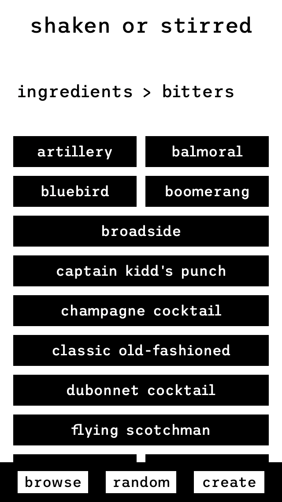
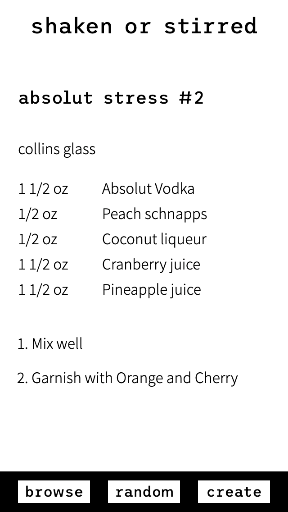
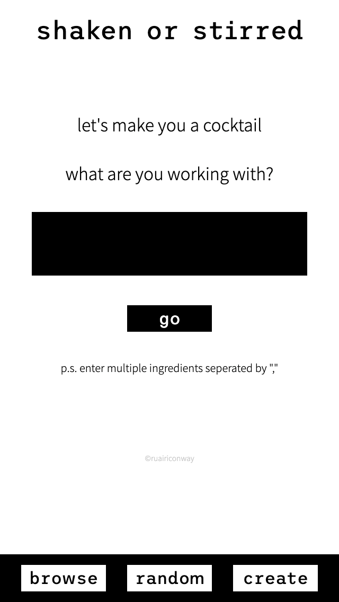
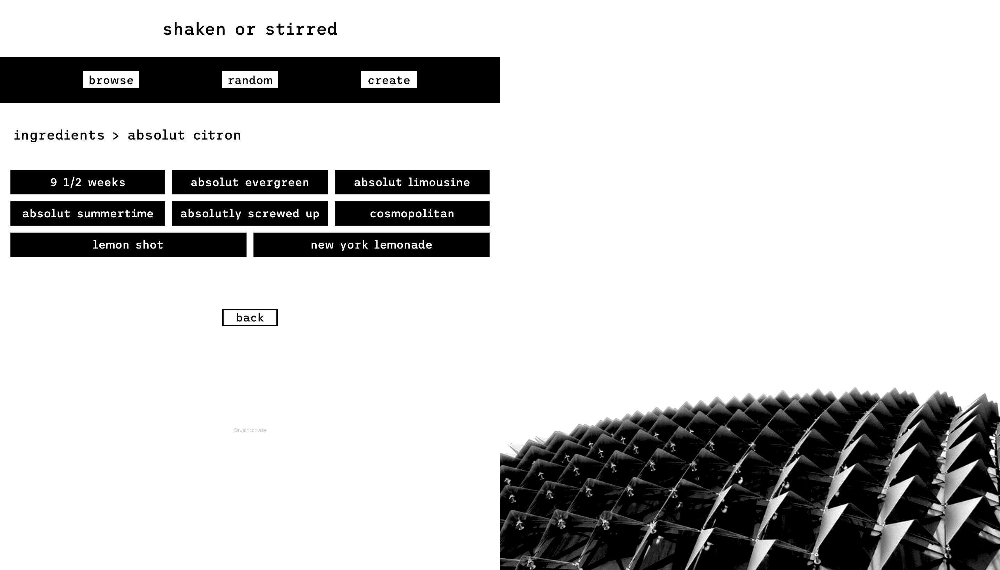
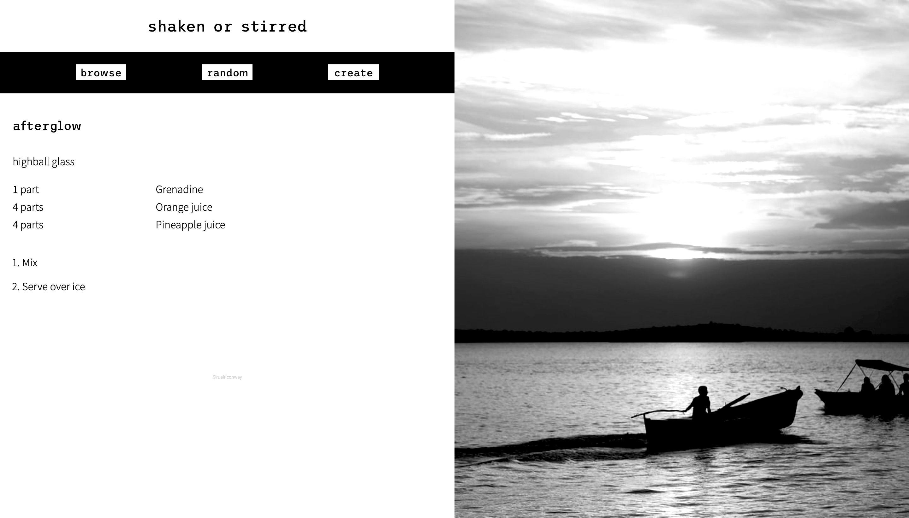
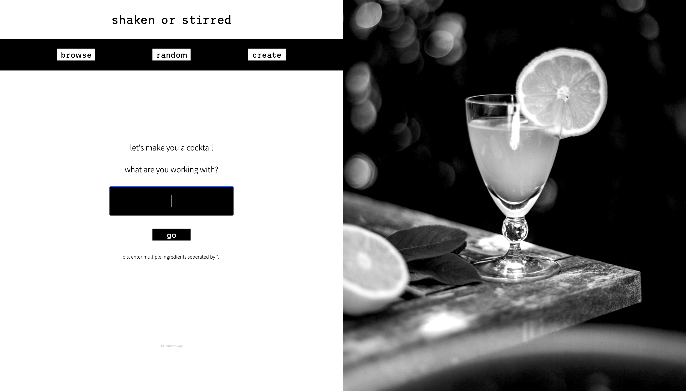

# Shaken or Stirred

- live - https://ruairiconway.github.io/shaken-or-stirred/
- code - https://github.com/ruairiconway/shaken-or-stirred

## Assignment
Thinkful Build - create an app that utilizes one or more APIs in an interesting way

## Summary
An app that provides cocktail recipes based on what the user has in hand! The user can also search by specific ingredient via 'browse', or find a random recipe via 'random'.

**Using the Cocktail DB API**, this app manipulates the API in three ways.
- Browse: lists all ingredients, which have complete recipes, that the DB uses.
- Random: finds a random recipe.
- Create: Pulls all recipes that match the users input, and then randomly selects from that pool to keep the app more interseting.

**Using the Unsplash API**, this app manipulates the API in two ways.
- Loads random image on page-load using a query, 'cocktail'.
- Loads image when a new recipe is displayed using a query based on the cocktail name.

## API reference
- The Cocktail DB - https://www.thecocktaildb.com/api.php
- Unsplash - https://unsplash.com/developers

## Screenshots
### Mobile

|  |  |  |

### Desktop

## Technology
- HTML
- CSS
- Javascript
- JQuery
- Node.js